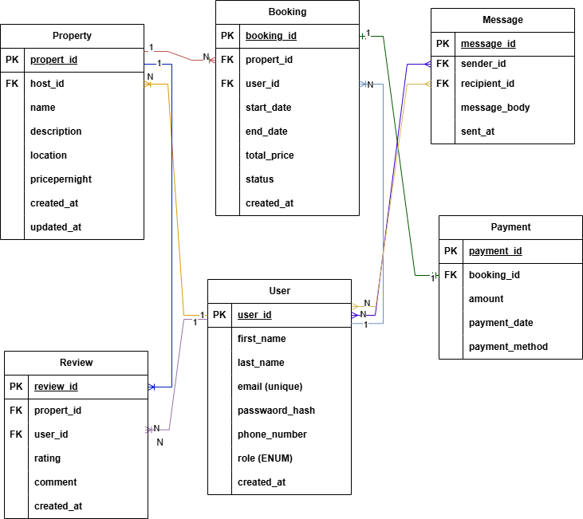

# ER Diagram Requirements

This document contains the Entity-Relationship Diagram (ERD) for the AirBnB Clone project database.

## 📊 ER Diagram

## 🗃️ Entities and Key Fields

### User
- user_id (PK)
- email (Unique)
- role (ENUM: guest, host, admin)

### Property
- property_id (PK)
- host_id (FK → User)

### Booking
- booking_id (PK)
- property_id (FK → Property)
- user_id (FK → User)

### Payment
- payment_id (PK)
- booking_id (FK → Booking)

### Review
- review_id (PK)
- user_id (FK → User)
- property_id (FK → Property)

### Message
- message_id (PK)
- sender_id (FK → User)
- recipient_id (FK → User)

## 🔗 Relationships
- One User can host many Properties
- One User can make many Bookings
- One Property can have many Bookings
- One Booking has one Payment
- One User can write many Reviews
- One Property can have many Reviews
- Users can send and receive Messages
